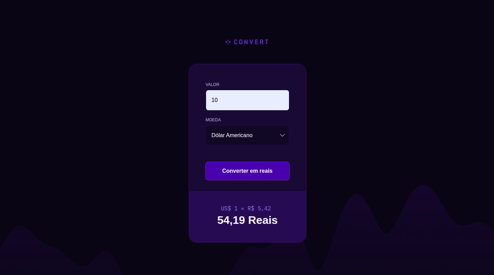
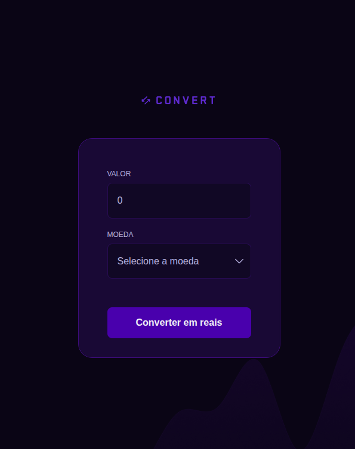
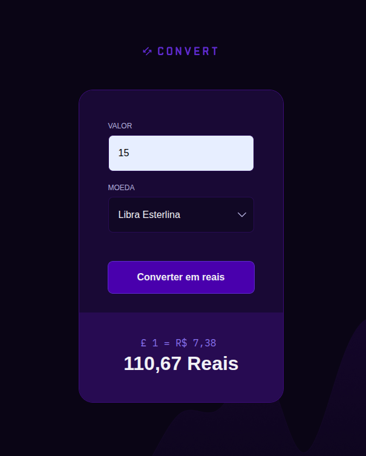

# 🪙 Convert

Conversor de moedas simples feito com HTML, CSS e JavaScript. O projeto permite converter valores em **Dólar Americano (USD)**, **Euro (EUR)** e **Libra Esterlina (GBP)** para **Real Brasileiro (BRL)** utilizando taxas de câmbio em tempo real obtidas via API.

<div align="center">
  
</div>

---

## 📌 Descrição

Aplicação desenvolvida como parte do módulo de **JavaScript Básico** da trilha **Full Stack** da [Rocketseat](https://www.rocketseat.com.br/).  
Durante esse projeto, exercitei conceitos fundamentais como:

- Declaração de variáveis e tipos;
- Manipulação do DOM;
- Estruturas condicionais;
- Controle de eventos;

Além disso, personalizei o projeto original com:

✅ **Estilização adaptada e responsiva**
✅ **Integração com API de câmbio** (`https://economia.awesomeapi.com.br`) para conversões reais  
✅ **Validação de formulário** e **tratamento de erros**

---

## 🚀 Funcionalidades

- Inserção de valor a ser convertido
- Seleção da moeda estrangeira
- Conversão para Reais (BRL) com taxa em tempo real
- Exibição do resultado da conversão

---

## 🖼️ Captura de Tela

| Tela Inicial                         | Conversão Realizada                        |
|-------------------------------------|--------------------------------------------|
|  |  |

---

## 🛠️ Tecnologias Utilizadas

- HTML5
- CSS3
- JavaScript
- API pública de câmbio: [AwesomeAPI](https://docs.awesomeapi.com.br/api-de-moedas)

---

## 📂 Como usar

1. Clone este repositório:
    ```bash
    git clone https://github.com/luc4svale/convert.git
    ```

2. Acesse o diretório:
    ```bash
    cd convert
    ```

3. Abra o `index.html` no navegador.

> Nenhuma instalação extra é necessária — o projeto é 100% front-end.

---

## 📚 Aprendizados

Esse projeto me ajudou a consolidar conceitos fundamentais de JavaScript e DOM, além de introduzir conceitos como requisições assíncronas e consumo de APIs externas.

---

## 📄 Licença

Este projeto está sob a licença MIT.

---

## 🔗 Acesse

> 💻 Você pode testar o projeto [**clicando aqui**](https://luc4svale.github.io/convert/)
